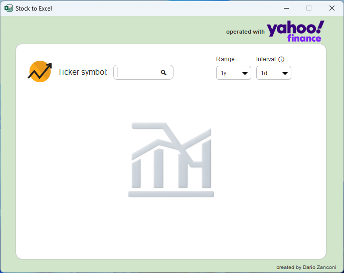
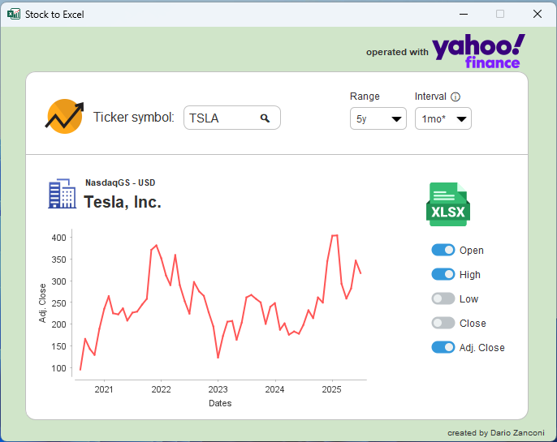

# Stock-To-Excel
Java Tool for viewing stock market data from Yahoo Finance and exporting to Excel

## Screenshots






## Features
- Search any ticker symbol (e.g. `AAPL`, `TSLA`, `MSFT`).
- Choose date range and interval (daily, weekly, monthly, custom `1mo*`).
- View price history as a chart (JFreeChart).
- Export Open, High, Low, Close, Adjusted Close values to Excel (Apache POI).
- Lightweight, self-contained Java Swing application.

---

## Technologies Used
- **Java 22**  
- **Swing** + JavaFX (UI and file chooser)  
- **Apache POI** (Excel export)  
- **JFreeChart** (chart rendering)  
- **Gson** (JSON parsing from Yahoo Finance)  
- **Maven** (build automation)

---

## Installation

Clone the repository:
```bash
git clone https://github.com/dariozanconi/stock-to-excel.git
cd stock-to-excel
